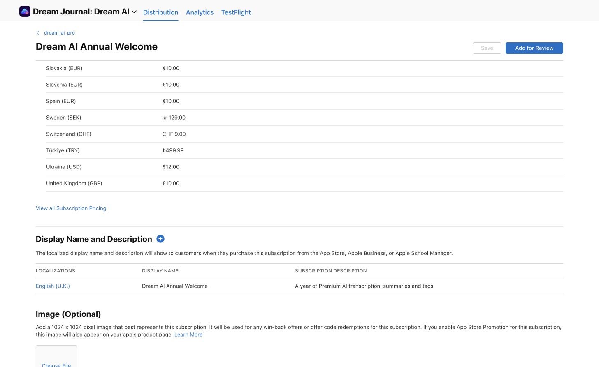

# Annual welcome offer

Configured on 8 October 2026 for Dream Journal: Dream AI. The user confirmed **£10 every year**, so this is a separate auto-renewing annual subscription with a regular £10 UK price, rather than a first-year introductory discount.

## App Store Connect

- App: `6740153274`, bundle `io.faith-tech.dreamAI`.
- Subscription group: `dream_ai_pro` (`21730538`).
- Product: `dream_ai_annual_welcome`, reference name **Dream AI Annual Welcome**.
- Apple subscription ID: `6820726695`.
- Duration: **1 year**, billed upfront annually.
- Saved United Kingdom price: **£10.00**. Apple generated equivalent prices for the other storefronts; availability includes all 175 countries or regions.
- English (U.K.) display name: **Dream AI Annual Welcome**.
- Description: **A year of Premium AI transcription, summaries and tags.**
- Current status: **Prepare for Submission**. It has not been submitted to Apple review. The review screenshot is still required.

[Open subscription](https://appstoreconnect.apple.com/apps/6740153274/distribution/subscriptions/6820726695)

## RevenueCat

- Project: Dream AI (`50f990d7`), iOS app `app667116ac93`.
- Matching product: `dream_ai_annual_welcome` (`prod05f4f8e584`), linked to the existing **pro** entitlement.
- Offering: **annual_welcome** (`ofrng2c0da57654`).
- One package: **$rc_annual**, connected to the new product.
- Paywall: **Dreamer Annual Welcome** (`wfe84daf890e0b4582`), published and assigned to `annual_welcome`.
- Existing current offering `dream_ai_annually` remains current. Its saved metadata now contains `{"onboarding_discount_offering_id":"annual_welcome"}`.
- Annual paywall uses `{{ product.price }}/year`, states that it renews yearly at the same price until cancelled, and has no trial or weekly alternative. Terms and Privacy open thedreamer.app URLs through separate actions from Restore Purchases.
- RevenueCat currently reports **Could not check** for the store product. Its catalog association is verified, but live store availability is not yet verified.

[Open RevenueCat product](https://app.revenuecat.com/projects/50f990d7/product-catalog/products/prod05f4f8e584)

[Open published paywall](https://app.revenuecat.com/projects/50f990d7/paywalls/wfe84daf890e0b4582/builder)

The editor preview uses a sample $69.99 price. This is a preview fixture, not the saved UK subscription price; actual purchases use the localized store product price.

## App behavior

- Closing the main native paywall presents the annual welcome paywall once.
- Onboarding's **Continue without Premium** or cancellation of its main native paywall shows the annual welcome offer screen. Onboarding manages this step itself so it does not also trigger a duplicate native follow-up.
- Declining the welcome offer lets the user continue free.
- The offer is only shown when RevenueCat returns an available product that is cheaper in the same currency and renewal period. Missing products or store errors do not display a made-up price.
- A purchase or restore still requires refreshed entitlement confirmation for the current journal owner. Switching identity during a purchase cannot grant Premium to the wrong journal.
- Main files: `contexts/SubscriptionProvider.tsx`, `components/onboarding/OnboardingOffer.tsx`, `util/paywall.ts`. Focused tests in `contexts/__tests__/SubscriptionProvider-test.tsx` cover fallback purchase, two declines, onboarding opt-out, store errors/not-presented, and owner changes.

## Validation and remaining release work

- `npx tsc --noEmit`: passed.
- Focused Jest: **2 suites, 32 tests passed**.
- ESLint for the changed purchase/onboarding files: passed.
- Browser inspection verified the saved £10 price, RevenueCat package/entitlement association, published paywall, localized price variable, and annual-only layout.
- No native build, app deployment, real purchase, or sandbox checkout was performed. The local app change still needs to be included in an app release.
- Before this product can be sold, capture its review screenshot from the app, validate its sandbox purchase and renewal behavior, and submit the subscription for Apple approval. RevenueCat's store status also needs to be rechecked once Apple's product and account integration are ready.
