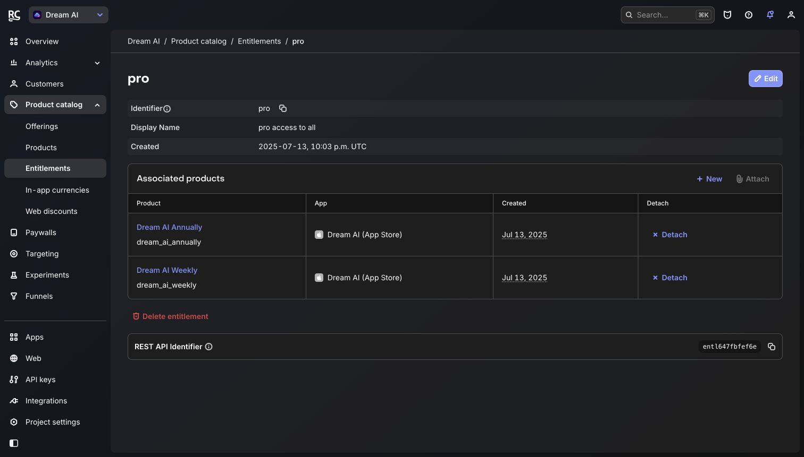
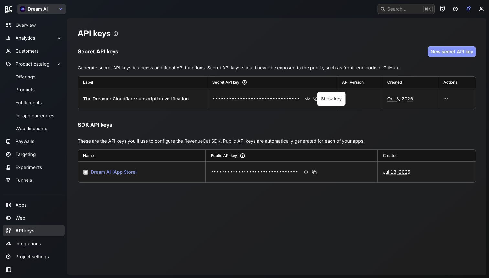
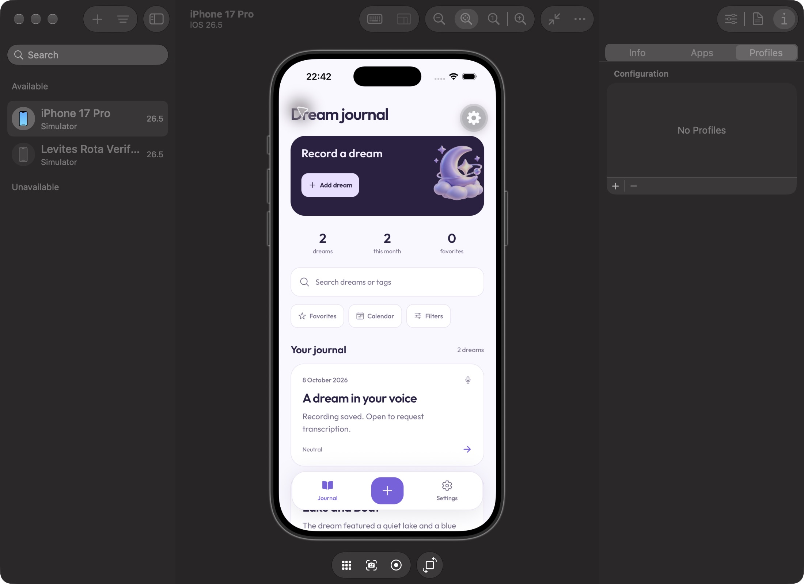
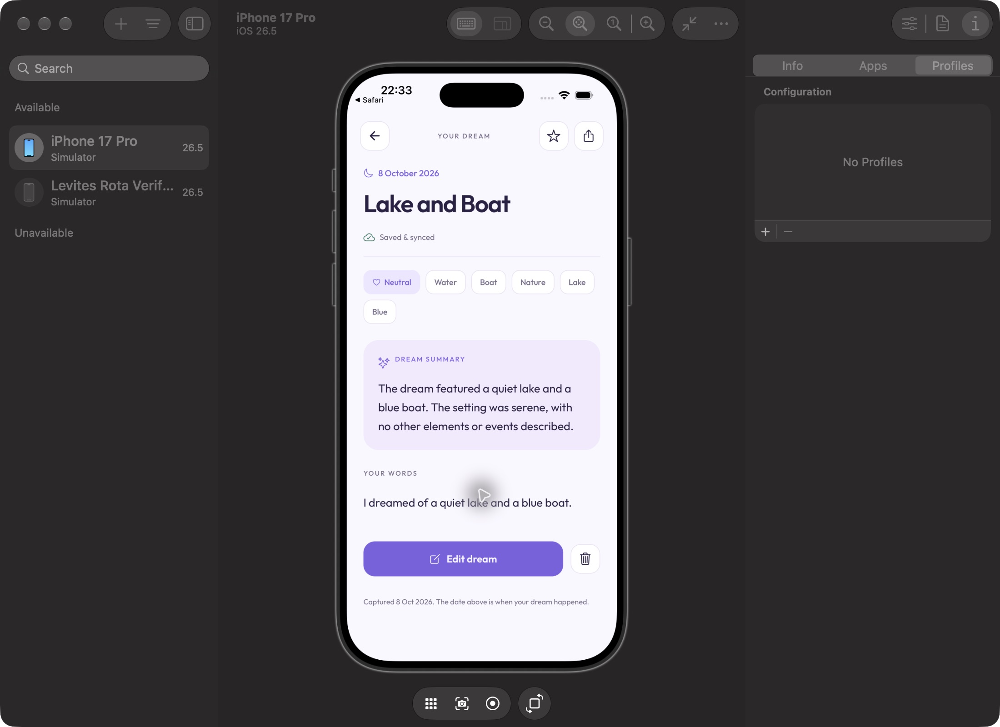
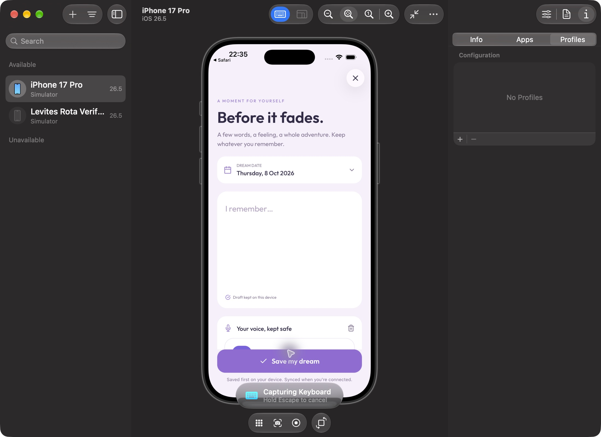
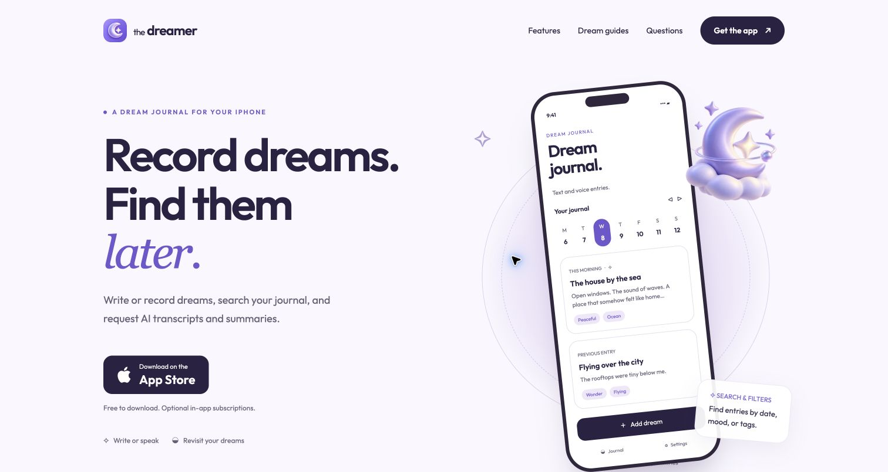
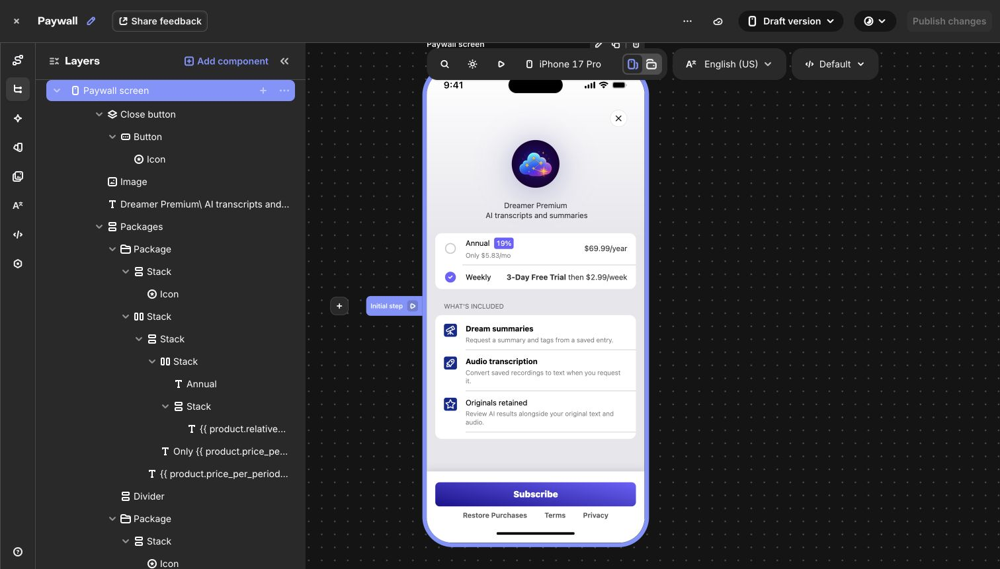
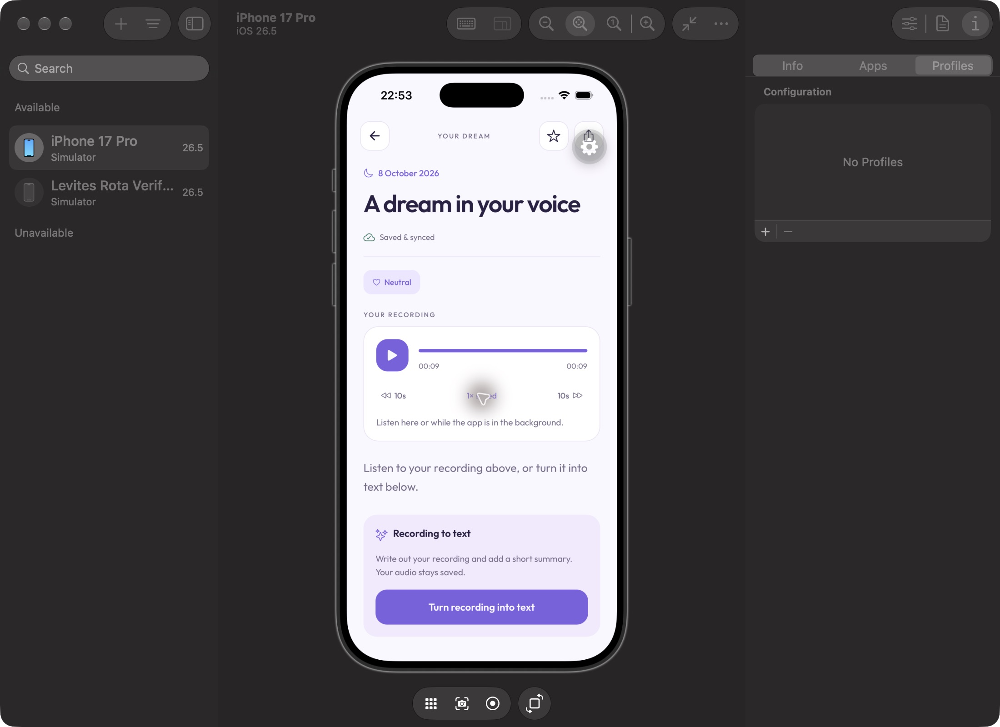

# The Dreamer rebuild — 8 October 2026

## Result

The backend is deployed at https://api.thedreamer.app. The mobile app uses Cloudflare Workers, D1, private R2, Workers AI, Cloudflare Email Sending and Better Auth. Supabase runtime code, SDK dependencies and local configuration have been removed. No legacy provider data or accounts were deleted.

Worker: `thedreamer-api`. Deployed version: `fdde8766-0e09-45ca-839e-b8887b57ccc6`.

Database: `dreamer-journal`. Private audio bucket: `dreamer-audio`.

## Product changes

- Save text and recordings locally before any network work, using stable entry UUIDs and a durable draft.
- Retry metadata/audio sync without duplicating entries. Keep deletion tombstones so stale requests cannot resurrect entries.
- Retain voice files in document storage; attach uploads and playback to their own entry. Pause/resume, interrupted capture recovery, finish/discard and clear recording errors.
- Persist processing states and retry failed/interrupted AI work. Preserve the original transcript if summary generation fails. Protect newer edits against an older AI result.
- Anonymous journal access with optional passwordless email linking. Verified account linking transfers journal ownership and preserves verified guest billing identities.
- Search text, titles, summaries, tags and keywords; combine mood, favorites, tags and date filters. Calendar uses the actual dream date.
- Complete dream details, edit title/date/mood/tags/transcript, share, favorite, playback controls and processing recovery.
- Lavender/light and midnight/dark visual system across journal, capture, details, navigation and settings.
- Reminder opt-in and saved hour/minute are respected. Scheduler operations are serialized so a rapid opt-out wins over older scheduling work.
- Short, functional copy replaces sentimental filler throughout the app, onboarding and site. Recovery instructions, privacy details, billing terms and user dream content are preserved. Recording is correctly described as free; AI processing uses free previews before Premium.
- The existing RevenueCat-hosted paywall now uses plain feature descriptions. The copy-only revision is published; product prices, offer variables and purchase actions are unchanged.
- Website copy is published at https://thedreamer.app, landing Worker version `76e96e92-26a1-4c14-9b1f-bbee48f880b4`.

## Purchases

RevenueCat project `50f990d7`, entitlement `pro` (`entl647fbfef6e`). Existing weekly and annual App Store products were missing entitlement associations; both are now attached to `pro`.

The approved server key has only Customers Read access. It is stored in the Worker's encrypted secrets and the ignored, mode-0600 development secrets file. No secret is bundled into the app.

Purchases establish the current Cloudflare identity before presenting the paywall or restoring. Login is serialized; simultaneous store operations are blocked. Fresh SDK results and server entitlements are scoped to the owner; stale responses cannot relock a newer successful purchase. Verified store access remains usable while the backend is unavailable. Guest billing identifiers survive email linking through server-created aliases.

Both native RevenueCat packages are upgraded to `10.12.1`; the prior SDK failed to compile with the installed Xcode 27 toolchain.

## Security and backend reliability

Owner checks apply to journal, audio, processing, entitlement and account operations. R2 has no public access. Strict origins, signed sessions, hashed short-lived email codes, request limits, file size/type validation, processing leases and persisted cleanup are enabled. AI keys and inference are entirely server-side. Provider redirects are rejected without forwarding credentials.

## Verified against the deployed backend

Checks used synthetic entries and two independent guest sessions; test accounts and their media were cleaned up.

- Custom-domain HTTPS health passes using ordinary system DNS and certificate verification.
- Anonymous sessions, idempotent save, backdated date and invalid-date rejection pass.
- Another owner receives 404 for private entries and audio.
- Private WAV upload, duplicate-upload checksum reuse and authenticated playback pass.
- The actual read-only RevenueCat key verifies a non-subscribed customer.
- Real Workers AI produces a faithful text summary and reuses a completed job.
- Real Workers AI transcribes a synthetic spoken recording and attaches its transcript and summary to the original entry.
- Deleted entries disappear; an old PUT cannot resurrect them.
- One authorized sign-in email arrived in the Gmail inbox and its code successfully signed in through Better Auth.

## Local validation

TypeScript and 88 mobile tests across ten suites pass, with one snapshot. Backend TypeScript and 26 integration tests pass. Expo dependency alignment passes. Expo Doctor passes 20 of 21 checks; the remaining warning is Amplitude's React Native Directory New Architecture metadata.

The iOS simulator build succeeds under Xcode 27. Native UI verification confirms anonymous access, text capture, Saved & synced status, actual Workers AI summary with original text retained, and voice recording start/pause/resume. Closing capture while recording retains the clip; reopening the draft retains its duration and playback; saving creates a distinct entry with private audio and Saved & synced status. After force-closing and reopening the app, both the text and recording entries remain; the recording retains its duration and plays to completion. The iOS paywall loads real weekly and annual products without a purchase.

Final iOS and Android production Hermes exports pass after the style and copy changes. The landing build/check validates four indexable pages, 52 links/assets and matching FAQ structured data; the updated homepage is visually verified live. Simulator testing found a styled-components runtime crash that compilation did not detect. The two remaining wrappers now use native components and StyleSheet; styled-components is removed from sources, dependency tree and lockfile. Frozen dependency installation, TypeScript and focused lint pass. Recorder accessibility grouping was repaired so screen readers expose its actions. Navigation remains available while a summary processes.

Account deletion tests confirm server acknowledgement precedes local deletion, failed requests preserve data, other owners' entries/files/tombstones remain, and late responses cannot restore a retired owner.

Final backend review adds correct 416 recording range responses, delayed durable cleanup for uploads whose metadata attachment fails, immediate processing restart after guest-to-email recovery, and pending email-code cleanup on deletion. All three migrations are applied remotely. The final deployed version passes the complete live synthetic integration checks again.

## Compatibility and release boundaries

The API is versioned under `/v1`. Legacy typed-text `/summary` links remain supported; old global recording URIs are never reused for a new entry. Existing storage IDs/preferences remain compatible. Historical Supabase journal data requires an owner-verified import if it is needed in this fresh backend.

No App Store/TestFlight release was submitted. A real iOS sandbox purchase and restore must still be proven on a store-enabled device before release; automated entitlement tests and backend verification are not a completed store transaction. The RevenueCat project currently has an App Store app; Android paid access needs its own configured Play Store app/public SDK key.

## Screenshots

## Background recording playback follow-up

A shared app-owned native player replaces the detail-screen player. Playback continues across navigation and app backgrounding; a compact player offers open, play/pause and stop from other screens. Native lock-screen controls use generic metadata, so private dream titles do not appear there. Audio-session operations are serialized; starting the microphone cancels playback and pending play requests, and deleted entries/account changes stop their playback. Files remain attached to their original entry. Loading errors, retry, bounded seeking and slower/faster playback are supported.

The expo-audio plugin explicitly enables background playback and disables background microphone recording. The already-built iOS app has its audio background mode; the generated Android manifest has the mediaPlayback foreground service. Configuration follows the [Expo SDK 57 audio documentation](https://docs.expo.dev/versions/v57.0.0/sdk/audio/).

Native iOS testing confirms playback remains after leaving the details screen. At half speed, a test recording advanced from 00:01 to 00:07 while the app was on the iOS Home screen and was still playing when reopened. Playback completed normally and speed was restored to 1x. Android background/lock-screen behavior still needs device verification; no new store release was submitted.

Audio conversion now says **Turn recording into text**, written entries say **Summarize dream**, and retry says **Try again**. Recording text replaces the technical Transcript heading. The original recording is always available independently of AI or Premium.

Seventeen meaningful service regression tests cover background audio mode/lock-screen metadata, navigation continuity, late-play cancellation, switching and stale events, microphone exclusion, native failures/retry, bounded seeking/replay, loading timeouts, cleanup failures and entry ownership checks after asynchronous setup. Full mobile suite: 88 tests, ten suites, one snapshot. TypeScript, lint and whitespace checks pass.

The requested subagent completed a focused playback review. Cancelling a load clears its spinner; failed playback shows a stopped, retryable state; teardown attempts all native cleanup even if one step throws; source ownership is checked immediately before playback. The compact player announces the recording title, state and elapsed time to screen readers. A failed microphone stop retains its audio session and captured file for retry, preventing competing playback. Newly created/edited drafts bind immediately to the current account; two regression tests verify account deletion clears them and another owner is preserved. Native testing after these guards confirms playback and navigation continue to work, the compact player's accessibility label includes 00:06 of 00:09, and Stop clears playback controls.
